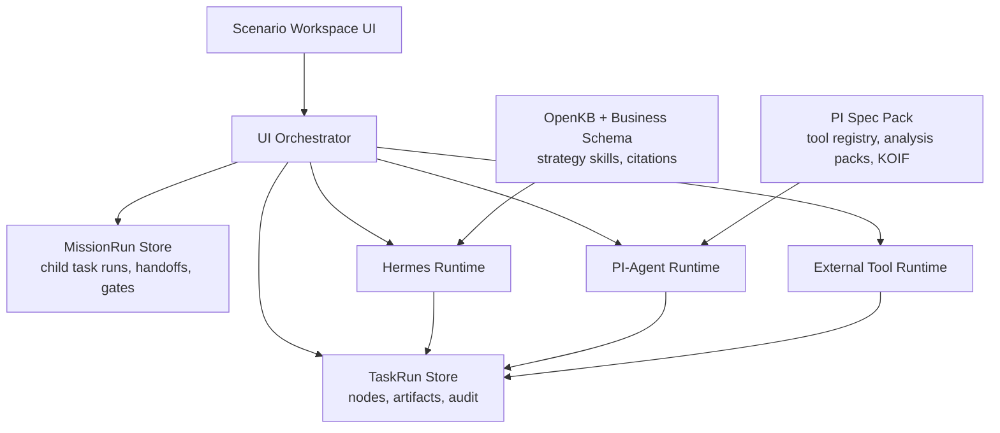

# Agent Runtime Orchestration Architecture

## Purpose

This document defines the target architecture for a UI workspace that treats
Hermes Runtime and PI-Agent Runtime as parallel execution layers.

The UI should not directly call scattered tools. It should create a task run
and let an orchestrator dispatch each playbook node to the appropriate runtime.

## Architecture



## Responsibilities

### Scenario Workspace UI

Responsibilities:

- show scenario catalog.
- show mission catalog.
- create task runs.
- create mission runs with child task runs.
- show node list, node status, artifacts, and gates.
- show scenario graph, artifact handoff, and cross-scenario gates.
- let users edit artifacts.
- let users rerun nodes.
- show chat and explanations in context of the active node.

The UI should show business process first. Technical trace is available in
details panels.

### UI Orchestrator

Responsibilities:

- load scenario playbooks.
- load mission manifests and scenario graph relations.
- create node runs from playbook definitions.
- create child TaskRuns from mission scenario plans.
- dispatch node runtime requests.
- enforce dependency and gate rules.
- enforce cross-scenario artifact handoff and mission gates.
- write audit events.
- store artifact versions.

The orchestrator owns state transitions. Runtimes do not directly mutate the UI.

### Hermes Runtime

Responsibilities:

- strategy explanation.
- OpenKB-backed query.
- business schema interpretation.
- launch brief synthesis.
- cross-node summarization.
- general execution planning.

Hermes may use generated strategy skills, but it should return structured
outputs to the orchestrator when used inside a node.

### PI-Agent Runtime

Responsibilities:

- API QA.
- tool selection.
- analysis packs.
- KOIF Router.
- PI Decision Layer.

PI-Agent is not only a data lookup backend. It can produce objective scores,
neutral next actions, and data-side decision proposals.

Decision proposals must include lineage, assumptions, and risk notes. They do
not bypass human review gates.

### External Tool Runtime

Responsibilities:

- browser control.
- local computer control.
- mobile control.
- backend/API mutation preview and execution.

External tool runtime must default to preview mode for state-changing actions.

## Dispatch Flow

```text
user creates task run
  -> orchestrator loads playbook
  -> node becomes ready
  -> user runs node
  -> orchestrator validates inputs and gates
  -> orchestrator sends runtime request
  -> runtime returns evidence/output/proposal
  -> orchestrator writes node run, artifacts, audit
  -> UI refreshes node and artifact state
```

Mission dispatch flow:

```text
user creates mission run
  -> orchestrator loads mission manifest and scenario graph
  -> orchestrator creates child task runs as they become ready
  -> upstream task run produces versioned artifacts
  -> orchestrator records artifact handoff
  -> cross-scenario gate approves or blocks downstream scenario
  -> downstream task run receives bound inputs
  -> mission audit records relation, handoff, and gate events
```

## Runtime Boundary

The Fusion Layer remains an intermediate mapping layer:

```text
strategy evidence
  -> business signal
  -> data evidence need
  -> PI-Agent request
  -> PI evidence / decision proposal
  -> playbook gate
```

It must not map natural language directly to raw APIs. API selection and data
execution belong to PI-Agent.

## State And Audit

Every important object has an id:

- `task_run_id`
- `mission_run_id`
- `node_id`
- `artifact_id`
- artifact handoff id
- scenario relation id
- PI `run_id`
- PI `router_run_id`
- PI `decision_run_id`
- Hermes conversation or strategy query id when available
- external tool run id when available

Final user-facing decisions should be traceable to:

- strategy source or citation.
- PI data evidence.
- PI decision proposal, if used.
- artifact version.
- human gate result.

## Rollout Strategy

Phase 1:

- local task store.
- scenario catalog.
- new product launch sample playbook.
- manual node run and rerun.

Phase 2:

- PI dedicated endpoints for more analysis packs.
- artifact diff view.
- dependency-aware node readiness.

Phase 3:

- richer Hermes structured runtime.
- external tool preview and approval workflow.
- multi-scenario playbook bundle.
