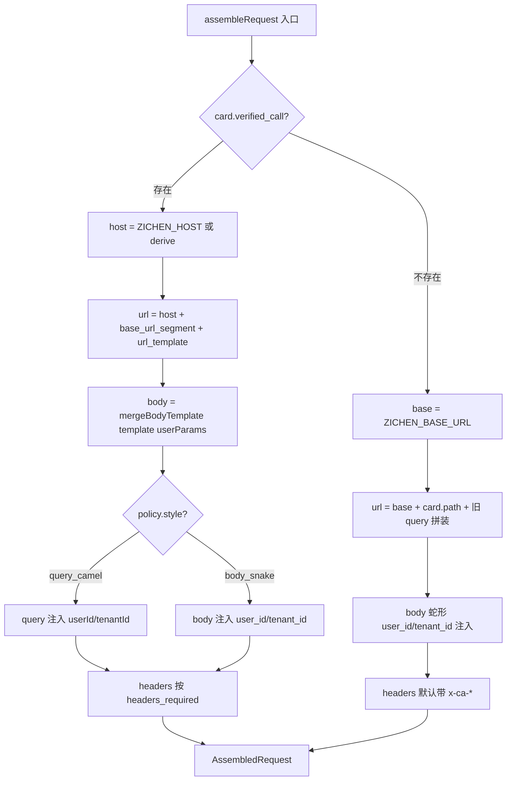

# Runtime Dispatch Specification

## 1. assembleRequest 决策树

`src/services/api_runtime.ts` 的 `assembleRequest(card, env, params)` 是所有出站请求的拼装入口。引入 validation overlay 后，行为按下表分流：

```
card.verified_call 是否存在?
├── 是  → §2 verified_call 分支
└── 否  → §3 legacy 分支
```



设计目标：
- verified_call 命中：URL/body/auth 全部来自人工调通过的真值，零猜测。
- 未命中：行为字节级等价于本规范引入前的版本，保证 fixture 与 legacy probe 不破。

## 2. verified_call 分支规范

### 2.1 URL 拼接

```
host = process.env.ZICHEN_HOST ?? deriveHostFromBaseUrl(env.baseUrl)
url  = host + verified_call.base_url_segment + filledTemplate(verified_call.url_template, userParams)
```

- `deriveHostFromBaseUrl(baseUrl)`：取 `baseUrl` 的 origin 部分（`<protocol>://<host>:<port>`），丢掉 path。例如 `http://122.227.49.54:30404/openApi/api/.../5/data/` → `http://122.227.49.54:30404`。
- `filledTemplate(template, userParams)`：
  - 模板形如 `/agent/sycm_keyword?userId={userId}&tenantId={tenantId}&tertiary_category={tertiary_category}`，但 §3 验证版本中通常不含占位符，userId/tenantId 的实际值已被 url-encode 后写死在 verified_url。
  - 实施时解析 `url_template` 的 path+query；用户 `params` 覆盖模板里已有的同名 query key（同名 key 以 user 为准，POST 也必须覆盖），GET 可追加新 query key；POST 不额外追加 body-only 字段，避免验证模板里的固定类目/日期污染 live 请求。
  - 占位符 `{xxx}`（若文档将来引入）由 `userParams.xxx` 替换；未提供则保留模板原值。

### 2.2 body 合并

```ts
body = mergeBodyTemplate(verified_call.body_template, userParams)
```

合并规则（浅合并）：
- 默认：`{ ...body_template, ...userParams }`，user 字段覆盖 template 缺省值
- user 字段值为 `null`：从结果中删除该键（用户显式清空）
- user 字段值为 `undefined`：等同于不传，保留 template 默认值

`mergeBodyTemplate` 不递归进对象/数组，因为 113 个 body_template 都是浅 key-value。

### 2.3 身份注入

按 `auth_inject_policy.style` 分两种：

**`query_camel`**（适用 113 个 success/19 个 empty 接口）：
- query 上添加 `userId=${env.userId}` 和 `tenantId=${env.tenantId}`
- body **不写** `user_id` / `tenant_id`
- 即使 `body_template` 里历史上含 `userId` 字段，env 值优先

**`body_snake`**（适用极少数历史接口；仅作为前向兼容）：
- body 上添加 `user_id`, `tenant_id`
- query **不写**

实施函数 `applyAuthPolicy(policy, env, query, body)` 输出更新后的 `{query, body, auth_inject: AuthInjectTrace}`，trace 记录注入位置便于报告。

### 2.4 headers

- `Content-Type: application/json` 始终带（POST/PUT/PATCH 的 body 序列化需要）。
- `auth_inject_policy.headers_required` 控制是否带 `x-ca-appCodeKey` / `x-ca-appCode`：
  - 默认 `["x-ca-appCodeKey", "x-ca-appCode"]`：带网关签名头，值取 `env.appCodeKey` / `env.appCode`
  - 若未来明确存在无签名头接口，可在 overlay 中显式建模；当前运行时对旧产物的空数组会按默认补齐
- 不引入其他 header，避免 CORS / 上游网关误判。

### 2.5 missing_required_params 校验

verified_call 命中时跳过当前 `pickRequiredQuery(card)` 的必填校验（因为校验依据来自 markdown 主链的 `request_schema.query`，与 verified_call 体系不一致）。

替代方案（Phase 2 兜底，Phase 3 完善）：
- 暂不做必填校验，依赖 `body_template` 的默认值兜底
- 若回包 code != 200，由上层 classifyProbeV2 报 hint，不在 assembleRequest 阶段拦截

## 3. legacy 分支规范

未命中时，`assembleRequest` 行为与本规范引入前完全一致：

- `url = ${env.baseUrl}${card.path}` + query 拼装
- body 注入蛇形 `tenant_id`/`user_id`
- headers 带 `x-ca-appCodeKey` / `x-ca-appCode`
- 现有 `pickRequiredQuery` 必填校验照旧

实现要求：
- 把当前 [src/services/api_runtime.ts](../src/services/api_runtime.ts) 的 `assembleRequest` 主体（除入口分支判断外）整体保留为 `legacyAssembleRequest`。
- fixture 路径（无 LIVE_PROBE）与 legacy probe（如 `probeApiSample` 对未命中 card 的调用）行为字节级等价。

## 4. 配置与回滚

### 4.1 .env 新增项

```bash
# 可选；缺失时 derive 自 ZICHEN_BASE_URL 的 origin
ZICHEN_HOST=http://122.227.49.54:30404
```

`ZICHEN_BASE_URL`、`ZICHEN_TENANT_ID`、`ZICHEN_USER_ID`、`ZICHEN_APP_CODE_KEY`、`ZICHEN_APP_CODE` 全部保持原样、原行为，不破坏向后兼容。

`loadProbeEnv()` 增 `host?: string`：缺失时由 `deriveHostFromBaseUrl` 兜底。

### 4.2 回滚开关

| 开关 | 作用 | 影响层 |
|---|---|---|
| `SKIP_VALIDATION_OVERLAY=1` | `build_cards.ts` 不读 overlay JSON，所有 cards 不挂 `verified_call` | 构建期 |
| `DBA_DISABLE_VERIFIED_CALL=1` | `assembleRequest` 强制走 legacy 分支，忽略 cards 上已有的 `verified_call` | 运行时 |

两个开关独立：
- 构建期开关：影响产物 `api_asset_cards.json`，需重跑 `npm run build:all`。
- 运行时开关：不影响产物，立即生效，便于 A/B 对照。

### 4.3 灰度策略

不在本期 Phase 2 实施，但运行时开关已为后续灰度铺垫：

- 全开：`DBA_DISABLE_VERIFIED_CALL` 不设
- 全关：`DBA_DISABLE_VERIFIED_CALL=1`
- 按 domain 灰度（未来）：可扩展为 `DBA_VERIFIED_CALL_ALLOWLIST=keyword,goods` 之类

## 5. AuthInjectTrace 扩展

为便于 web Inspector 可观测，`AssembledRequest.auth_inject` 增字段：

```ts
auth_inject: {
  header: string[];          // 已有
  body: string[];            // 已有
  query: string[];           // 已有
  policy_style?: "query_camel" | "body_snake" | "legacy_snake";
  source?: "verified_call" | "legacy";
}
```

`legacy` 分支输出 `policy_style: "legacy_snake"`、`source: "legacy"`；命中分支输出对应 verified_call 的 style 和 `source: "verified_call"`。Inspector 能直接显示「该请求来自验证版还是文档默认」。

## 6. 测试覆盖

`tests/golden_cases/validation_overlay_cases.yaml`（Phase 2 新增）必含 3 case：

**Case A · verified_call 完整性**：
- 6 个 P0 卡（`agent_sycm_keyword` / `agent_blue_ocean_keywords_analysis` / `agent_keyword` / `data_keyword_trend` / `data_blue_keyword_7d_v2` / `data_ads_industry_keywords_summary_m`）必须有 `verified_call`
- `auth_inject_policy.style === "query_camel"`
- 至少其中 4 张卡的 `body_template.tertiary_category === "入户地垫"` 或 `"沙发垫"`

**Case B · 命中分支 URL 形态**：
- 输入：`agent_sycm_keyword` + `params = { tertiary_category: "入户地垫" }`
- 输出 `assembled.url` 满足：
  - 以 `http://122.227.49.54:30404/openApi/api/1958050182385065986/5/agent/sycm_keyword?` 开头
  - query 含 `userId=`、`tenantId=`、`tertiary_category=`
- 输出 `assembled.body` 满足：
  - JSON 对象
  - 不含 `tenant_id` / `user_id`（蛇形）
- 输出 `assembled.auth_inject.policy_style === "query_camel"`、`source === "verified_call"`

**Case C · 未命中走 legacy**：
- 取一张确定无 verified_call 的 card（从 175 接口中挑一个不在全量验证版.md 内的）
- 输出 `assembled.body` 含 `tenant_id` / `user_id` 蛇形
- 输出 `assembled.auth_inject.source === "legacy"`、`policy_style === "legacy_snake"`

## 7. 不在本规范范围

- contract probe runner（自动调用 verified_call 探活、维护 `last_verified_at`）
- 灰度策略具体实现（domain allowlist / percentage）
- verified_call.url_template 的占位符语法（本期靠字面值复用，未来可引入 `{xxx}` 占位符）
- POST 之外 method（PUT/PATCH）的 body 合并语义（暂无样本）

## 8. 未解决风险

- `mergeBodyTemplate` 浅合并对嵌套对象不递归；若文档将来引入嵌套 body（如 `"price_list": ["0","50"]`），用户传入 `{ price_list: ["0"] }` 会整体覆盖而非合并。当前样本无此问题。
- `deriveHostFromBaseUrl` 假设 `ZICHEN_BASE_URL` 是同一 host；若未来引入多 host（dev / prod 分流），需要把 host 显式声明到 `verified_call.base_url_segment` 之前。
- query_camel 注入的 userId/tenantId 来自 `env`，但 `body_template` 里有时也含 `userId`（如 series 79+ 老接口）；当前以 env 为准，若 body_template 显式想用其他用户，需要走 user params 显式覆盖。