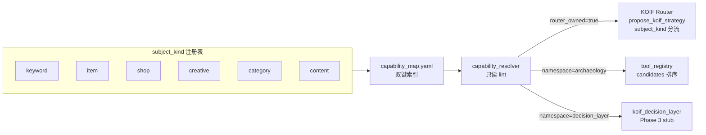
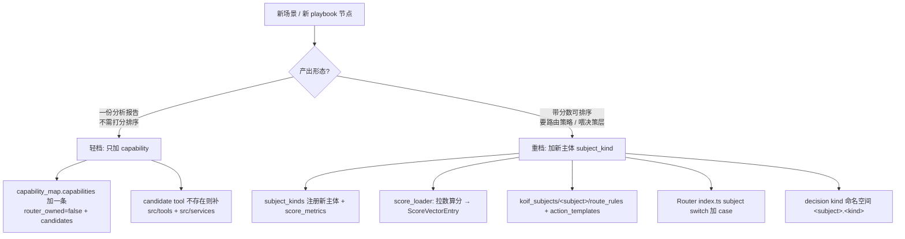
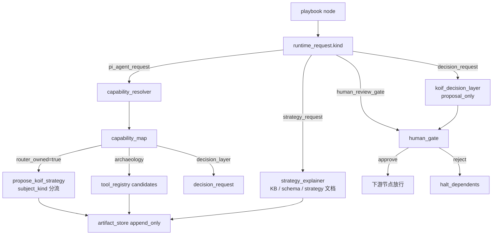
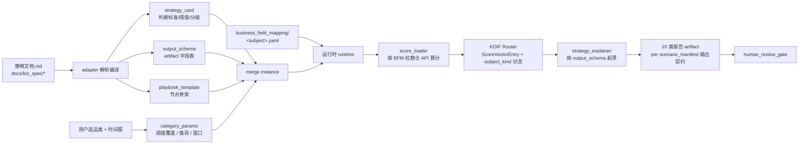
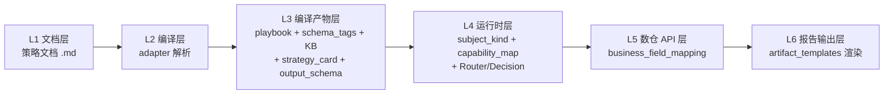

# 23 KOIF Subject_Kind and Runtime Fusion Spec

> Phase 1 单一真相：把「评分主体 subject_kind」立成 KOIF Router / Decision Layer / capability_map 的一等公民，固化新场景扩展的轻档 / 重档分级 SOP，并锚定 Phase 1 实施边界。
>
> 状态：Draft，Batch 0 Pending Review。
>
> 上游：[docs/14_KOIF_NAMESPACE_OVERVIEW.md](14_KOIF_NAMESPACE_OVERVIEW.md) §2 / [docs/15_KOIF_ROUTER_SPEC.md](15_KOIF_ROUTER_SPEC.md) §2 / [docs/19_KOIF_DECISION_LAYER_SPEC.md](19_KOIF_DECISION_LAYER_SPEC.md) / [docs/22_BUSINESS_STRATEGY_WORKSPACE_ADAPTER_INTEGRATION.md](22_BUSINESS_STRATEGY_WORKSPACE_ADAPTER_INTEGRATION.md) / [AGENTS.md](../AGENTS.md) §1.1。

## §1 背景与问题陈述

### §1.1 现状

KOIF Router 与 Decision Layer 在工程层全部按「关键词」单一主体硬编码：

- [src/services/koif_router/types.ts](../src/services/koif_router/types.ts) `ScoreVectorEntry.keyword: string` 写死，`CapabilityCode = "kds" | "tms" | "cps"` 写死。
- [src/services/koif_router/route.ts](../src/services/koif_router/route.ts) DSL 正则只识别 `kds|tms|pvs|ces|pfs|nos|bds|cps` 8 个评分 metric。
- [src/services/koif_decision/types.ts](../src/services/koif_decision/types.ts) `DecisionKind` 5 枚举（`paid_test_plan` / `sku_supply_plan` / `content_calendar` / `defensive_paid_plan` / `category_entry_plan`）全部在关键词域。
- [registry/koif_route_rules.yaml](../registry/koif_route_rules.yaml) 单文件混所有规则，无主体分桶。

### §1.2 业务侧已经跨主体

[registry/derived/scenario_workspace/scenarios/marketing_insight/playbook/playbook.json](../registry/derived/scenario_workspace/scenarios/marketing_insight/playbook/playbook.json) 已经出现非关键词主体的节点：

- `category_market_analysis` / `price_band_opportunity` 是类目级。
- `review_qa_pain_analysis` 是评论级。
- `industry_top300_analysis` 是商品级聚合。

### §1.3 即将引入的扩展主体

- **主图策略**：creative 级（差异化分 / CTR 分 / 视觉对比分）。
- **商品诊断**：item 级（健康分 / 漏斗分 / 库存分）。
- **店铺诊断**：shop 级（DSR / 客单 / 复购）。

### §1.4 风险

若 Phase 1 不引入主体抽象，下批扩展会全面返工 Router/Decision 类型、规则文件、UI badge 与 capability_map schema。本规范的目标是把主体抽象在 Phase 1 一次性落到 schema 层。

## §2 subject_kind 一等公民契约

### §2.1 6 主体语义表

| subject_kind | 主体语义 | 典型 subject_id 形态 | Phase 1 状态 |
| --- | --- | --- | --- |
| `keyword` | 关键词 | `"拖把"` / `"tpu 餐桌垫"` | implemented |
| `item` | 商品 SKU | `"1234567890"`（item_id） | planned |
| `shop` | 店铺 | `"shop_abc"` / shop_id | planned |
| `creative` | 创意 / 主图 | `"creative_xxx"` | planned |
| `category` | 类目 | `"121364010"`（category_id） | planned |
| `content` | 内容 / 笔记 | `"note_xxx"` | planned |

**status 语义**：
- `implemented`：Router/Decision 已支持该主体（Phase 1 仅 keyword）。
- `planned`：schema 占位，Phase 1 代码返 `subject_unsupported_phase1`；UI 标灰显示。

### §2.2 subject_id 命名规则

- `keyword`：直接用关键词文本（如 `"拖把"`）。
- `item / shop / creative / content`：用平台 ID（如 `"1234567890"`）。
- `category`：优先用淘宝类目 ID（如 `"121364010"`），缺失时可用类目名兜底。

Router `ScoreVectorEntry.subject_id` 为主键；`subject_label` 可选补人可读名（如 item 主体的 `subject_id="1234567890"` + `subject_label="拖把 A 款"`）。

### §2.3 各主体 score_metrics 表

| subject_kind | 典型 score_metrics（Phase 1 占位） |
| --- | --- |
| `keyword` | `[kds, tms, cps, pvs, ces, pfs, nos, bds]` |
| `item` | `[ihs (item_health_score), ics (item_conversion_score), iss (item_stock_score)]` |
| `shop` | `[shs (shop_health_score), scs (shop_customer_score), srs (shop_reputation_score)]` |
| `creative` | `[cds (creative_diff_score), ccs (creative_ctr_score), cvs (creative_visual_score)]` |
| `category` | `[]`（类目暂无评分，仅作 context） |
| `content` | `[ces (content_engagement_score), cps (content_propagation_score)]` |

Phase 1 只实现 keyword 的 8 metrics（[docs/14](14_KOIF_NAMESPACE_OVERVIEW.md) §2），其余主体占位为空数组或草案名。

### §2.4 capability → subject_kind 映射关系



playbook node 的 `capability` 字段与 capability_map 的 `capabilities.<name>` 主键闭环，通过 `subject_kind` 字段确认主体归属。

---

## §3 capability_map schema 草案

### §3.1 schema_version

`koif-capability-map-v1`

### §3.2 subject_kinds 全局注册表

```yaml
subject_kinds:
  keyword:
    status: implemented
    score_metrics: [kds, tms, cps, pvs, ces, pfs, nos, bds]
  item:
    status: planned
    score_metrics: []
  shop:
    status: planned
    score_metrics: []
  creative:
    status: planned
    score_metrics: []
  category:
    status: planned
    score_metrics: []
  content:
    status: planned
    score_metrics: []
```

### §3.3 capabilities 双键索引（Phase 1 只注册 marketing_insight 实用 7 capability）

```yaml
capabilities:
  keyword_demand:
    subject_kind: keyword
    namespace: archaeology
    router_owned: true
    score_metric: kds
    candidates: [analyze_keyword_demand]

  keyword_competition:
    subject_kind: keyword
    namespace: archaeology
    router_owned: true
    score_metric: cps
    candidates: [analyze_keyword_competition]

  category_market_analysis:
    subject_kind: category
    namespace: archaeology
    router_owned: false
    candidates: [analyze_category_top_products]

  review_qa_pain_analysis:
    subject_kind: keyword
    namespace: archaeology
    router_owned: false
    candidates: []   # Phase 1 unresolved

  price_band_opportunity:
    subject_kind: category
    namespace: archaeology
    router_owned: false
    candidates: []   # Phase 1 unresolved

  koif_router:
    subject_kind: keyword
    namespace: archaeology
    router_owned: true
    candidates: [propose_koif_strategy]

  opportunity_score:
    subject_kind: keyword
    namespace: decision_layer
    router_owned: false
    candidates: [propose_koif_decision]
```

### §3.4 字段语义

- `subject_kind`：主体归属（6 选 1）。
- `namespace`：归属层（`archaeology` / `knowledge` / `decision_layer`）。
  - `archaeology`：客观可观测、可复算、不依赖商家成本结构（判定锚 [AGENTS.md](../AGENTS.md) §1.1）。
  - `decision_layer`：含主观假设 / 预算分摊 / 机会成本。
  - `knowledge`：KB / schema / strategy 解释。
- `router_owned`：该 capability 是否由 KOIF Router 提供（true 时 candidates 必须含 `propose_koif_strategy`）。
- `score_metric`：该 capability 产出的评分 metric 名（router_owned=true 时必填）。
- `candidates`：候选工具列表（按 `tool_registry.yaml` 的 `agent_ready` 状态优先排序；空数组表示 Phase 1 unresolved）。

### §3.5 capability_resolver 只读 lint 规则（Phase 1 实施）

`web/lib/workspace.mjs::resolvePlaybookCapabilities()` 执行以下校验，结果填 `bundle.lint`：

1. playbook node 的 `capability` 是否在 capability_map → 否则标 `unknown_capability`。
2. `subject_kind` 是否 `status: implemented` → 否则标 `subject_planned`（UI 标灰）。
3. `candidates` 是否在 `tool_registry.yaml` → 否则标 `unresolved_capability`（UI 标红）。
4. `router_owned=true` 时 candidates 必须含 `propose_koif_strategy` → 否则标 `router_integrity_violation`。

Phase 1 只做只读 lint，不实际 dispatch 工具。

---

## §4 新场景扩展分级 SOP（核心决策依据）

### §4.1 判定问题

引入新场景 / 新 playbook 节点时，先回答一个问题：

> **该场景产出的是「一份分析报告」，还是「一组带分数、可排序、可触发策略动作的对象」？**

按答案落入轻档或重档。



### §4.2 轻档 SOP（产出报告即可）

适用于：店铺诊断只出一份诊断报告、商品健康度只看一张表。**纯 registry + 一个 tool，零碰 Router 内核。**

改动清单：

1. `registry/koif_capability_map.yaml` 的 `capabilities` 下加一条：
   ```yaml
   <new_capability>:
     subject_kind: <existing_or_new>
     namespace: archaeology
     router_owned: false
     candidates: [<tool_id>]
   ```
2. 若 `<tool_id>` 不存在：
   - 新建 `src/tools/<tool_id>.ts` thin wrapper。
   - 新建 `src/services/<service>/index.ts` 业务逻辑。
   - 在 [.pi/extensions/db_archaeologist.extension.ts](../.pi/extensions/db_archaeologist.extension.ts) 注册 pi tool。
   - 在 [registry/tool_registry.yaml](../registry/tool_registry.yaml) 登记 `agent_ready` 状态。
3. 不动 Router 内核。
4. 不动 capability_map.subject_kinds（除非引入新主体且只是 context 不评分）。

### §4.3 重档 SOP（要进 KOIF 评分排序）

适用于：主图给创意打差异化分并排序、商品给 SKU 打健康分供 Router 路由。

改动清单：

1. `subject_kinds` 注册新主体：
   ```yaml
   subject_kinds:
     <new_subject>:
       status: implemented
       score_metrics: [<m1>, <m2>, ...]
   ```
2. 实现 score_loader：拉数 → 算分 → 输出 `ScoreVectorEntry[]`，每行带 `subject_kind`/`subject_id`/`scores`/`available_scores`。
3. 新建主体规则目录：
   ```text
   registry/koif_subjects/<new_subject>/
     route_rules.yaml       # 阈值规则
     action_templates.yaml  # 动作模板
   ```
4. [src/services/koif_router/index.ts](../src/services/koif_router/index.ts) 主入口 `switch (subject_kind)` 加一个 case，分发到该主体的 score_loader / rules。
5. 若需决策类输出：[src/services/koif_decision/types.ts](../src/services/koif_decision/types.ts) 的 `DecisionKind` 加 `<new_subject>.<kind>` 命名空间形态。
6. 在 capability_map.capabilities 下登记该主体的 router_owned capability（`router_owned: true` + `score_metric` + `candidates: [propose_koif_strategy]`）。
7. UI 需要：playbook 节点 badge 自动按 `subject_kind` 显色（前端读 capability_map）。

### §4.4 「加 capability list」≠ 全部扩展

用户常用的简化说法是「加 capability list」，对应轻档；这条路径覆盖**只出报告**的扩展。重档的核心代价不在 capability list，而在 score_loader / rules 文件 / Router switch case / decision 命名空间四件套。

判定原则锚 [AGENTS.md](../AGENTS.md) §1.1：客观可复算 → archaeology；含主观假设 / 预算 / 机会成本 → decision_layer。决策类话术不进 spec-pack。

---

## §5 主图 / 商品 / 店铺扩展示例（占位，仅文档不入 registry）

下列示例仅用于演示 §4 SOP 的应用，**Phase 1 不进 registry**。

### §5.1 主图策略（重档：creative）

```yaml
subject_kinds:
  creative:
    status: implemented   # 假设已落地
    score_metrics: [cds, ccs, cvs]

capabilities:
  creative_diff_analysis:
    subject_kind: creative
    namespace: archaeology
    router_owned: true
    score_metric: cds   # creative_diff_score
    candidates: [propose_koif_strategy, analyze_creative_diff]
```

`registry/koif_subjects/creative/route_rules.yaml` 草图：

```yaml
high_diff_low_ctr:
  cn_name: 高差异低 CTR
  priority: 1
  conditions: ["cds >= 70", "ccs <= 40"]
  actions: [creative_iterate]
  reason_template: |
    差异化分 CDS={cds:.1f}（≥70）但 CTR 分 CCS={ccs:.1f}（≤40）。
    建议保留视觉差异，优化核心卖点呈现。
```

decision kind：`creative.creative_iterate_plan` / `creative.creative_ab_test_plan`。

### §5.2 商品诊断（重档：item）

```yaml
subject_kinds:
  item:
    status: implemented
    score_metrics: [ihs, ics, iss]

capabilities:
  item_health_diagnosis:
    subject_kind: item
    namespace: archaeology
    router_owned: true
    score_metric: ihs
    candidates: [propose_koif_strategy, analyze_item_health]
```

`registry/koif_subjects/item/route_rules.yaml` 草图：

```yaml
declining_item:
  cn_name: 下滑商品
  priority: 1
  conditions: ["ihs <= 40", "ics <= 50"]
  actions: [item_revival_candidate]
  reason_template: |
    商品健康分 IHS={ihs:.1f}（≤40）且转化分 ICS={ics:.1f}（≤50）。
    建议进入下滑诊断流程。
```

decision kind：`item.item_revival_plan` / `item.item_clearance_plan`。

### §5.3 店铺诊断（轻档示例）

若店铺诊断只产出一份「DSR / 客单 / 复购」综合报告，无需排序，走轻档：

```yaml
capabilities:
  shop_diagnosis_report:
    subject_kind: shop
    namespace: archaeology
    router_owned: false
    candidates: [analyze_shop_diagnosis]
```

零碰 Router 内核，只补一个 `src/tools/analyze_shop_diagnosis.ts` 即可。

若后续需要给店铺打综合健康分供 Router 路由，再升级为重档（注册 `shop` 主体的 `score_metrics`）。

---

## §6 Router 单入口 + subject_kind 分流规范

### §6.1 工具入参演进

[src/tools/propose_koif_strategy.ts](../src/tools/propose_koif_strategy.ts) 与 [.pi/extensions/db_archaeologist.extension.ts](../.pi/extensions/db_archaeologist.extension.ts) 的 `propose_koif_strategy` 注册参数加 `subject_kind`：

- 类型：`enum [keyword, item, shop, creative, category, content]`。
- 默认值：`keyword`（向后兼容历史调用）。
- Phase 1 仅 keyword 走完整逻辑，其余主体在 service 层 fail-fast。

### §6.2 类型层改造（[src/services/koif_router/types.ts](../src/services/koif_router/types.ts)）

`ScoreVectorEntry` 字段调整：

- 新增 `subject_kind: SubjectKind`。
- 新增 `subject_id: string`（关键词文本 / item_id / shop_id / creative_id 等，按 §2.2 命名规则）。
- 新增 `subject_label?: string`（可读名）。
- 现有 `keyword: string` 字段保留为 `subject_id` 别名，过渡期内 keyword 主体的 `subject_id === keyword`，便于历史 `registry/koif_routes/*` 产物兼容。
- `scores` 类型由写死 8 metric 改为 `Record<string, number>`，metric 名由 capability_map 注册表权威定义。
- `CapabilityCode` 收敛为 `string`（具体合法集由 capability_map 校验，不再写死）。

### §6.3 DSL 正则放宽（[src/services/koif_router/route.ts](../src/services/koif_router/route.ts)）

`parseCondition` 的正则由：

```text
/^\s*(kds|tms|pvs|ces|pfs|nos|bds|cps)\s*(>=|<=|>|<|==)\s*(-?[\d.]+)\s*$/i
```

放宽为：

```text
/^\s*([a-z][a-z0-9_]*)\s*(>=|<=|>|<|==)\s*(-?[\d.]+)\s*$/i
```

未在 `entry.scores` 中注册的 metric 视为 `false`（评估为不命中），不报错。`renderReason` 模板同步支持任意 metric 名。

### §6.4 主入口分流（[src/services/koif_router/index.ts](../src/services/koif_router/index.ts)）

主入口加 `switch (subject_kind)`：

- `case "keyword"`：走现有 KDS / TMS / CPS 三路（即当前 Phase 3 行为，零变更）。
- `default`（item / shop / creative / category / content）：直接返：
  ```json
  {
    "error": "subject_unsupported_phase1",
    "subject_kind": "<value>",
    "hint": "Phase 1 仅支持 keyword 主体，其余主体规划见 docs/23 §4"
  }
  ```

### §6.5 规则文件目录结构

目标结构（**Phase 1 仅在文档登记，不迁移文件**）：

```text
registry/
  koif_route_rules.yaml              # 旧文件, Phase 1 仍读, 视作 keyword 分支
  koif_action_templates.yaml         # 旧文件, 同上
  koif_subjects/
    keyword/
      route_rules.yaml               # 后续迁移目标 (Phase 2)
      action_templates.yaml
    item/                            # 占位目录 (Phase 1 不创建)
    shop/
    creative/
```

迁移触发条件：当第二个 `status: implemented` 的主体出现时，按 Phase 2 计划统一迁移到 `koif_subjects/<subject>/` 结构。Phase 1 行为 100% 等价于现状。

---

## §7 Decision Layer 命名空间化规范

### §7.1 现状

[src/services/koif_decision/types.ts](../src/services/koif_decision/types.ts) 的 `DecisionKind` 5 个值（`paid_test_plan` / `sku_supply_plan` / `content_calendar` / `defensive_paid_plan` / `category_entry_plan`）全部在关键词域，扁平命名空间。新主体扩展时无法区分「这是关键词的付费测试」还是「这是创意的付费测试」。

### §7.2 命名空间化形态

`DecisionKind` 改为 `<subject_kind>.<kind>` 双段式：

```ts
export type DecisionKind =
  | "keyword.paid_test_plan"
  | "keyword.sku_supply_plan"
  | "keyword.content_calendar"
  | "keyword.defensive_paid_plan"
  | "keyword.category_entry_plan";
```

后续主体扩展时分别加：

- 主图：`creative.creative_iterate_plan` / `creative.creative_ab_test_plan`
- 商品诊断：`item.item_revival_plan` / `item.item_clearance_plan` / `item.item_listing_optimize_plan`
- 店铺诊断：`shop.shop_dsr_recovery_plan` / `shop.shop_repurchase_boost_plan`
- 内容：`content.content_calendar_plan`

### §7.3 向后兼容映射

新增常量 `LEGACY_DECISION_KIND_ALIAS`：

```ts
export const LEGACY_DECISION_KIND_ALIAS: Record<string, DecisionKind> = {
  paid_test_plan:        "keyword.paid_test_plan",
  sku_supply_plan:       "keyword.sku_supply_plan",
  content_calendar:      "keyword.content_calendar",
  defensive_paid_plan:   "keyword.defensive_paid_plan",
  category_entry_plan:   "keyword.category_entry_plan",
};
```

`proposeKoifDecision` 入口归一化：先查命名空间形态 → 否则查 alias → 否则返 `decision_kind_unsupported`。Phase 1 仅做参数规范化，所有合法调用仍返 `decision_layer_phase3_stub`，不实质化。

### §7.4 边界判定（锚 [AGENTS.md](../AGENTS.md) §1.1）

| 输出形态 | 归属层 | 示例 |
| --- | --- | --- |
| 客观可观测、可复算、不依赖商家成本结构 | archaeology | 关键词需求强度 KDS、竞争压力 CPS、主图差异化分 CDS |
| 含主观假设、预算分摊、机会成本、商家成本结构 | decision_layer | 付费测试预算、ROI 阈值、SKU 进退场建议、跑量周期 |

`opportunity_score` / `launch_brief` / `link_planning` 三个 playbook 节点在 capability_map 标 `namespace: decision_layer`，UI 强制显示 `proposal_only` badge，且必须经 `human_approval` gate 通过才允许下游执行（Phase 1 UI 只读展示，不执行）。

---

## §8 runtime_contract v2 提案

### §8.1 现状

[registry/derived/scenario_workspace/runtime_contract.json](../registry/derived/scenario_workspace/runtime_contract.json) v1 仅 5 字段：

```json
{
  "schema_version": "playbook-runtime-contract-v1",
  "entrypoints": ["scenario", "mission"],
  "artifact_versioning": "append_only",
  "cross_scenario_handoff": "versioned_artifacts_only",
  "pi_decision_layer": "proposal_only"
}
```

不足以支撑 NodeRun / Artifact / Gate 执行层。

### §8.2 v2 字段表

```yaml
schema_version: playbook-runtime-contract-v2
entrypoints: [scenario, mission]

runtime_request_kinds:
  pi_agent_request:
    dispatch: capability_resolver
    layer: archaeology
  strategy_request:                          # 知识层：KB / schema / strategy 文档解释、artifact 起草
    dispatch: strategy_explainer
    layer: knowledge
    compat_aliases: [hermes_request, strategy]   # adapter 编译产物里的历史/透传值，PI-Agent 归一化后入参
  decision_request:
    dispatch: koif_decision_layer
    layer: decision
    proposal_only: true
  human_review_gate:
    dispatch: human_gate
    layer: gate

node_io:
  schema_dialect: jsonschema-draft7
  input_binding: scenario_inputs + upstream_artifacts
  output: artifact_template_id

artifact_store:
  medium: fs
  root: registry/derived/scenario_runs
  versioning: append_only
  version_key: "run_id/node_id/v{n}"

cross_node_ref: "@{node_id}.artifact.{template_id}"

gate_model:
  approver: ui_user
  ttl_hours: 0
  on_reject: halt_dependents

failure:
  policies: [request_user_input, record_failure_and_continue, record_failure_and_block_dependents]
  retry: { max: 0, backoff: none }

concurrency:
  task_run_per_mission: multiple
  node_idempotency_key: "run_id/node_id/input_hash"

pi_decision_layer: proposal_only
cross_scenario_handoff: versioned_artifacts_only

subject_kind_dispatch:
  keyword:  implemented
  item:     planned
  shop:     planned
  creative: planned
  category: planned
  content:  planned
```

### §8.3 dispatch 流程图



### §8.4 Phase 1 兼容策略

- adapter 暂未升 v2，Phase 1 透传现有 v1。
- `web/lib/workspace.mjs` 读取 runtime_contract 时按字段缺失兜底为 v1 默认 dispatch_table（与 §8.2 等价）。
- adapter 编译产物 playbook 的 `runtime_request.kind` 仍可能携带 `hermes_request` / `strategy` 历史值（来自 docs/22 透传），`workspace.mjs` 归一化映射到 `strategy_request` 后再入 dispatch 流程。
- v1 → v2 的真正升级在 Phase 2，由 adapter 团队配合落地。

---

## §9 Phase 1 实施边界 + 交叉引用

### §9.1 Phase 1 只动 schema 不动行为

| 改动维度 | Phase 1 范围 | Phase 1 不做 |
| --- | --- | --- |
| Router 工具入参 | 加 `subject_kind` 可选 enum | 不实现 keyword 以外主体的逻辑 |
| Router 类型 | `ScoreVectorEntry` 加 `subject_kind`/`subject_id`，`scores` 改 `Record<string,number>` | 不动 keyword 主体的算分流程 |
| Router 主入口 | `switch (subject_kind)` 分流，非 keyword 返 `subject_unsupported_phase1` | 不实现 item / shop / creative 分支 |
| Router DSL 正则 | 放宽为 `[a-z][a-z0-9_]*` | 不变更 keyword 规则文件内容 |
| 规则文件 | 仅在文档登记 `registry/koif_subjects/<subject>/` 目标结构 | 不迁移 keyword 规则到新目录 |
| Decision 类型 | `DecisionKind` → `keyword.<kind>` + alias | 不实质化决策算法 |
| capability_map | 新增 `registry/koif_capability_map.yaml`（Phase 1 注册 7 capability） | 不注册主图 / 商品 / 店铺 capability |
| Web 只读 | 4 endpoint + Workspace tab + 只读 lint badge | 不执行 playbook 节点 |
| git 卫生 | `.gitignore` + scenario_workspace track + 不变量 `scenario_workspace_not_in_rebuild_scope`（WARN） | 不清理 git 历史中已误入的 run 产物 |
| adapter | 不动 adapter 代码 | runtime_contract v2 升级在 Phase 2 |

### §9.2 不做（硬边界）

- Phase 1 不执行任何 playbook 节点、不调 PI tool、不实质化 decision_layer。
- Phase 1 不实现 keyword 以外主体的 Router 分支（占位返 `subject_unsupported_phase1`）。
- 不迁移 keyword 规则文件到 `registry/koif_subjects/keyword/`（仅文档登记目标结构）。
- 不改 adapter 代码（runtime_contract v2 升级走 Phase 2）。
- 不清理 git 历史中已误入的 run 产物（独立任务）。
- candidates 为空的节点（review_qa_pain_analysis / price_band_opportunity）UI 标 unresolved，不报错。

### §9.3 交叉引用

| 引用对象 | 引用关系 |
| --- | --- |
| [docs/14_KOIF_NAMESPACE_OVERVIEW.md](14_KOIF_NAMESPACE_OVERVIEW.md) §2 | 8 capability 全景表，本规范 §2.3 score_metrics 表锚定该表 |
| [docs/15_KOIF_ROUTER_SPEC.md](15_KOIF_ROUTER_SPEC.md) §2 / §5 | Router 工具契约、route_rules / action_templates 形态。本规范 §6 升级 schema |
| [docs/19_KOIF_DECISION_LAYER_SPEC.md](19_KOIF_DECISION_LAYER_SPEC.md) | Decision Layer 物理形态。本规范 §7 命名空间化决议 |
| [docs/21_PHASE_3_COMPLETION_AND_RISK_SPEC.md](21_PHASE_3_COMPLETION_AND_RISK_SPEC.md) | Phase 3 完成 / Core Lock / 不变量。本规范新增 `scenario_workspace_not_in_rebuild_scope`（WARN）登记到该处 |
| [docs/22_BUSINESS_STRATEGY_WORKSPACE_ADAPTER_INTEGRATION.md](22_BUSINESS_STRATEGY_WORKSPACE_ADAPTER_INTEGRATION.md) | adapter 与 PI-Agent 集成边界。本规范 §3 / §8 与之配合 |
| [AGENTS.md](../AGENTS.md) §1.1 | KOIF / archaeology 边界、decision_layer 判定原则。本规范 §7.4 锚定 |

### §9.4 待审核要点

Batch 0 提请审核的核心要点：

1. **subject_kind 6 主体清单**（§2.1）是否完整？是否需要新增 `bundle`（套餐）/ `live`（直播间）等主体？
2. **score_metrics 表**（§2.3）的 item / shop / creative 草案命名是否合适？
3. **capability_map schema**（§3）是否同意 `subject_kinds` + `capabilities` 双键索引设计？
4. **扩展分级 SOP**（§4）的「轻档 / 重档」判定标准是否清晰？
5. **Router 单入口 + subject_kind 分流**（§6）是否同意保留单一 `propose_koif_strategy` 入口而不拆 Router 家族？
6. **Decision 命名空间形态**（§7.2）`<subject_kind>.<kind>` 是否同意？
7. **runtime_contract v2 字段表**（§8.2）是否覆盖 NodeRun / Artifact / Gate 执行层的最小可用集？
8. **Phase 1 实施边界**（§9.1）是否同意「只动 schema 不动行为」？

审核通过后进入 Batch 1：逐文件 diff 级技术实施方案。

---

## §10 策略本体与 artifact schema 泛化（场景/品类四件套）

> 本节扩展自 Batch 0 二轮：把"业务策略文档 → SOP → 节点策略 → 字段 I/O → 数仓 API → 报告"6 层链路的 4 个硬编码阻塞点结构化下沉到 schema 层，使同一份 `marketing_insight` playbook 能横跨家具 / 数码配件 / 服饰 / 母婴等品类，无需重写。
>
> §10 的所有产物在 Phase 1 仍是 **schema 形态 + 只读 lint**，不实质化 strategy_explainer，不执行 playbook node。
>
> §10 已锁定的 4 项决议（来源：审核门 1 用户回复）：
>
> | # | 决议 | 落点 |
> | --- | --- | --- |
> | A | `keyword_field_mapping.yaml` 迁到 `registry/business_field_mapping/keyword.yaml` | §10.4 |
> | B | `category_params.thresholds` 优先级压过 `strategy_card.品类_overrides` 合理 | §10.5 |
> | C | strategy_explainer Phase 2 落到 spec-pack 内 `src/services/strategy_explainer/` | §10.8 |
> | D | condition DSL 仅 `and` 隐式连接，`or`/`not` 拆 judgment id + `first_match` | §10.2 |

### §10.1 现状泛化阻塞点

对账"业务文档 → SOP → 节点策略 → 字段 I/O → 数仓 API → 报告"6 层链路，识别出 4 个硬编码阻塞点：

| 阻塞点 | 现状位置 | 阻塞表现 |
| --- | --- | --- |
| 节点策略本体 | [registry/derived/scenario_workspace/scenarios/marketing_insight/schema/schema_tags.json](../registry/derived/scenario_workspace/scenarios/marketing_insight/schema/schema_tags.json) `perspectives.客户业务专家视角.执行步骤[*].evidence_quote` | 判断标准 / 阈值 / 分级全部埋在长文本里，没下沉到结构化 node |
| artifact 输出字段表 | [registry/derived/scenario_workspace/scenarios/marketing_insight/playbook/artifact_templates/keyword_demand_table.json](../registry/derived/scenario_workspace/scenarios/marketing_insight/playbook/artifact_templates/keyword_demand_table.json) | 只有 `{artifact_id, title, content_type, versioning, editable}` 5 字段空壳，没有 row / field 字段定义 |
| 业务字段→数仓 API 映射 | [registry/keyword_field_mapping.yaml](../registry/keyword_field_mapping.yaml) | 只覆盖 keyword 主体；category / item / shop 主体无对应 mapping 文件 |
| playbook 实例化层 | [registry/derived/scenario_workspace/scenarios/marketing_insight/playbook/playbook.json](../registry/derived/scenario_workspace/scenarios/marketing_insight/playbook/playbook.json) | 是"市场分析洞察 × 通用品类"的已实例化产物，换品类要重写整份；无 template + 品类参数包分层 |

四件套对应解：`strategy_card`（§10.2） / `output_schema`（§10.3） / `business_field_mapping/<subject>.yaml`（§10.4） / `playbook_template + category_params`（§10.5）。

### §10.2 strategy_card schema（节点策略本体）

为每个 playbook node 在 capability_map.capabilities 下扩一段 `strategy_card`，把判断标准 / 阈值 / 分级从 `evidence_quote` 长文本结构化下沉：

```yaml
capabilities:
  keyword_demand:
    subject_kind: keyword
    namespace: archaeology
    router_owned: true
    score_metric: kds
    candidates: [analyze_keyword_demand]
    strategy_card:
      schema_version: strategy-card-v1
      doc_anchors:
        - source_path: docs/biz_spec/marketing_insight/关键词分析后的 8 个必输出结论与判断标准.md
          kb_page_id: openkb-page-eight-keyword-conclusions
      output_dimensions: [需求结构, 人群需求, 场景需求, 功能需求, 属性需求, 趋势需求, 痛点需求, 升级需求]
      judgments:
        - id: trend_keyword
          label: 趋势关键词
          condition: "tms >= 70 and search_volume_growth_rate >= 0.30"
          output_field: { demand_dimension: 趋势需求 }
        - id: mainstream_keyword
          label: 主流需求
          condition: "search_volume_share >= 0.05"
          output_field: { demand_dimension: 需求结构 }
      品类_overrides:
        家具:
          trend_keyword: { condition: "tms >= 65 and search_volume_growth_rate >= 0.25" }
        数码配件:
          trend_keyword: { condition: "tms >= 75 and search_volume_growth_rate >= 0.40" }
```

字段语义：

- `doc_anchors`：策略来源文档锚点，KB 引用必须能从 [registry/derived/scenario_workspace/scenarios/marketing_insight/kb/citations.json](../registry/derived/scenario_workspace/scenarios/marketing_insight/kb/citations.json) 反查到。
- `output_dimensions`：该 node 对应 artifact 行级输出维度的全集（与 §10.3 `output_schema` 的 enum 字段对齐）。
- `judgments[*].condition`：走 §6.3 已放宽的 DSL（`[a-z][a-z0-9_]*`），未注册的 metric 视 `false`，不报错。
- `judgments[*].output_field`：命中后写入 artifact 行的字段值（key/value 均按业务字段名，避免英文术语）。
- `品类_overrides`：以三级类目名为 key，覆盖 base `condition` / `output_field`，按 §10.5 `category_params` 注入合并。

Phase 1 边界：`strategy_card` 仅入 schema + capability_resolver 只读 lint，不参与计算。lint 项：`doc_anchors` 必须能在 `kb_manifest.json` 找到；`judgments[*].condition` 必须 DSL 合法；`品类_overrides` 的 key 必须存在于 `category_params/<category_id>.json` 注册的三级类目集合内（缺则 `category_override_unresolved`，WARN 级）。

condition DSL 组合规则（Phase 1 决议）：

- 仅支持 `and` 隐式连接，多条件并列写法 `a >= 70 and b >= 0.30 and c <= 50`，按从左到右短路求值。
- 不支持 `or` / `not` 显式关键字。需要"或/否"语义时，拆为多个 judgment id，由 `derive: first_match` 在 `output_schema` 层做命中优先级排序。
- 不支持括号嵌套、算术运算、函数调用。
- 不识别的 metric 视为 `false`（与 §6.3 一致），整条 condition 不命中，不报错。

### §10.3 artifact output_schema（节点输出字段表）

artifact_template 当前只有 5 字段空壳，无法支撑 strategy_explainer 起草。在 artifact_template JSON 内增补 `output_schema` 段，定义 row 与 field 级契约：

```json
{
  "artifact_id": "keyword_demand_table",
  "title": "关键词需求表",
  "content_type": "json",
  "versioning": "append_only",
  "editable": false,
  "output_schema": {
    "schema_version": "artifact-output-v1",
    "rows": {
      "type": "array",
      "min_count": 20,
      "item": "keyword_demand_row"
    },
    "keyword_demand_row": {
      "keyword":          { "type": "string",  "source": "@score_loader.subject_id" },
      "demand_strength":  { "type": "number",  "source": "@score_loader.scores.kds", "required": true },
      "demand_dimension": { "type": "enum",    "source": "@strategy_card.judgments", "derive": "first_match" },
      "pain_quote":       { "type": "string",  "source": "@review_qa_pain_analysis.artifact.pain_point_table.top_quote", "optional": true }
    },
    "required_check": [
      "rows.length >= 20",
      "distinct(rows.demand_dimension) >= 3"
    ]
  }
}
```

字段语义：

- `source`：跨节点 / 跨产物引用，走 §8.2 `cross_node_ref` 语法 `@{node_id}.artifact.{template_id}.{field}`；`@score_loader.*` 与 `@strategy_card.*` 是当前节点本地特殊作用域。
- `derive`：可选枚举（`first_match` / `last_match` / `aggregate`），定义如何从 `strategy_card.judgments` 命中结果映射到字段值。
- `required_check`：行级 / 表级 invariant，strategy_explainer 起草后必须满足；Phase 1 仅 lint 校验，不实质化。

Phase 1 边界：`output_schema` 仅写到 artifact_template JSON，BFF 只读暴露（[web/server.mjs](../web/server.mjs) `/api/workspace/artifact_template/:id`），无 strategy_explainer 起草。lint 项：`source` 引用的 node_id / template_id 必须在 capability_map / playbook 中存在；缺则 `cross_node_ref_unresolved`。

### §10.4 business_field_mapping schema（业务字段→数仓 API 映射）

现有 [registry/keyword_field_mapping.yaml](../registry/keyword_field_mapping.yaml) 是 keyword 主体的特例。Phase 1 在 docs/23 §10 登记泛化目录形态并迁移 keyword 文件：

```text
registry/business_field_mapping/
  keyword.yaml      # 由现有 keyword_field_mapping.yaml 迁移而来（Batch 2 步骤 10）
  category.yaml     # 占位 (analyze_category_top_products 用)
  item.yaml         # 占位 (item 主体 / 商品诊断)
  shop.yaml         # 占位 (shop 主体 / 店铺诊断)
  creative.yaml     # 占位 (creative 主体 / 主图策略)
```

每份按主体分文件，schema 与现有 `keyword_field_mapping.yaml` 保持三段式（`apis` / `fields` / `aggregation`，[docs/18](18_KEYWORD_FIELD_MAPPING_SPEC.md) §3 定义）：

```yaml
schema_version: business-field-mapping-v1
subject_kind: keyword

apis:
  shafadian.keyword_search_volume:
    base_url_env: ZICHEN_BASE_URL
    method: POST
    headers: { tenant-id: $TENANT_ID, user-id: $USER_ID, app-code: $APP_CODE }
    response_root: data.result

fields:
  search_volume:
    api: shafadian.keyword_search_volume
    path: response_root[*].totalNum
    aggregation: sum
  search_volume_share:
    derive: search_volume / sum(search_volume)
  search_volume_growth_rate:
    derive: (search_volume - prev_period.search_volume) / prev_period.search_volume

aggregation:
  group_by: [keyword]
  window: { default: last_full_month, trend: last_3_full_months }
```

Phase 1 边界：

- `keyword.yaml` 由现有 `registry/keyword_field_mapping.yaml` 迁移到 `registry/business_field_mapping/keyword.yaml`（Batch 2 步骤 10）。迁移流程严格遵守 AGENTS.md §8 五步 SOP：
  1. 备份原文件至 `registry/_archive/keyword_field_mapping.<YYYYMMDD-HHmm>.yaml`。
  2. `git mv registry/keyword_field_mapping.yaml registry/business_field_mapping/keyword.yaml`。
  3. 同步改三处加载点：[src/services/keyword_demand/live_pull.ts](../src/services/keyword_demand/live_pull.ts) / [src/services/keyword_competition/strategies/live_pull.ts](../src/services/keyword_competition/strategies/live_pull.ts) / [src/pipelines/build_cards.ts](../src/pipelines/build_cards.ts)（如有引用）将路径常量切到新位置。
  4. 真机三件套（投流域 + 沙发垫窗口 LIVE probe）回归。
  5. `npm run test:golden` + `npm run test:invariants` GREEN，`npm run smoke:pi` GREEN。
- `category.yaml` / `item.yaml` / `shop.yaml` / `creative.yaml` 仅留空 schema 占位文件（含 `schema_version` / `subject_kind` / 空的 `apis` / `fields` / `aggregation`），运行时按 `subject_kind` 查找时走 §6.4 fail-fast 返 `mapping_unsupported_phase1`。
- AGENTS.md §8 的 5 步 SOP 对每个新主体 mapping 文件同样适用，禁止跳步。

迁移触发对齐 Phase 1：keyword 域**强制迁移**，不留旧路径兼容。原因是路径变更只动 3 处常量、零业务逻辑动；保留旧路径会让 `subject_kind → mapping path` 的映射出现两个事实源，违反单一真相。Batch 1 详细文档会列三处常量的精确替换。

### §10.5 playbook_template + 品类参数包（场景/品类分层）

现有 `playbook.json` 是「场景 × 品类」的已实例化产物。Phase 1 把分层契约写进 docs/23 §10，物理形态由 adapter 在 Phase 2 落地：

```text
adapter 编译产物（目标）：
  registry/derived/scenario_workspace/scenarios/<scenario_id>/
    playbook/
      playbook_template.json        # 场景骨架: nodes + depends_on + capability + strategy_card 引用
    category_params/
      <category_id>.json            # 品类参数包: 阈值 overrides + tertiary_category + 时间窗 + 竞品池

spec-pack 运行时（目标）：
  playbook_instance = merge(playbook_template, category_params)
```

playbook_template 字段表：

```yaml
schema_version: playbook-template-v1
scenario_id: marketing_insight
nodes:
  - node_id: keyword_demand
    capability: keyword_demand          # 引用 capability_map.capabilities.<name>
    depends_on: []
    runtime_request: { kind: pi_agent_request, tool: analyze_keyword_demand }
    input_schema_ref: "@scenario.inputs"
    artifact_templates: [keyword_demand_table]
    strategy_card_ref: "@capability.keyword_demand.strategy_card"
```

category_params 字段表：

```yaml
schema_version: category-params-v1
scenario_id: marketing_insight
category_id: "121364010"
tertiary_category: 沙发垫
date_range: { start: "2026-02-01", end: "2026-04-30" }
competitor_pool: [shop_a, shop_b]
thresholds:
  trend_keyword:    { tms_min: 65, growth_min: 0.25 }
  mainstream_keyword: { share_min: 0.05 }
```

合并规则：

- `playbook_template` 不含品类信息，跨品类不变。
- `category_params.thresholds.<judgment_id>` 覆盖 `strategy_card.judgments[id=<judgment_id>].condition` 中的同名变量阈值；未覆盖的判断保持 base condition。
- `date_range` / `competitor_pool` / `tertiary_category` 注入到 playbook node 的 `runtime_request.params` 中（具体注入点由 capability 各自的 input_schema 指定）。
- 若 `strategy_card.品类_overrides` 与 `category_params.thresholds` 同时给出，`category_params` 优先级更高（外部输入压过文档侧默认）。

合理性论证（Phase 1 决议）：

- `strategy_card.品类_overrides` 来源是策略文档作者的**先验默认**，节奏慢、跨品类抽象、滞后于市场变化。
- `category_params.thresholds` 来源是用户**当下选品类**时注入的运行参数，节奏快、随时间窗与竞品池同时调整。
- 两者重合时，外部输入压过文档侧默认符合"运行参数优先于文档默认"通行原则，与 Web 配置层、特征开关层、数据库默认值层一致。
- 反向（文档侧压外部输入）会让用户在 UI 改阈值不生效，违反所见即所得，且无法在不动 adapter 的前提下做品类临时调参。
- 合并实现位置：[web/lib/workspace.mjs](../web/lib/workspace.mjs) `resolvePlaybookForCategory()` 内做 `Object.assign(base, override, params)`，`params` 最后写入。

Phase 1 兼容策略：

- adapter 暂不拆 playbook_template；spec-pack 读 `playbook.json` 时按缺字段视为已实例化，新增 `category_params_path` 可选字段，无值则按"通用品类"运行。
- [web/lib/workspace.mjs](../web/lib/workspace.mjs) 提供 `resolvePlaybookForCategory(scenario_id, category_id)` 只读 lint：若 `strategy_card.品类_overrides` 含某品类但未提供 `category_params`，标 `category_params_required`（WARN 级，不阻塞展示）。

### §10.6 数据流：四件套如何串

四件套的整体编织：



四件套定位：

- **strategy_card**：把"什么算趋势 / 什么算主流"从文档下沉到结构化判定；对应 schema_tags 「客户业务专家视角」执行步骤。
- **output_schema**：把"报告里每行该有哪些字段、字段从哪来"从空壳填实；strategy_explainer 起草的硬契约。
- **business_field_mapping**：把"业务字段名 → 数仓 API 字段路径 + 聚合方式"从 keyword 单例泛化为多主体目录。
- **playbook_template + category_params**：把"场景骨架 × 品类参数"从合体的 playbook.json 解耦，换品类只换参数包。

Phase 1 仅串通 schema 层（四件套的形态、引用关系、lint），不串通运行时（不实际调 score_loader / strategy_explainer）。

### §10.7 家具→数码配件最小演示（仅文档登记）

同一份 `marketing_insight` playbook_template，搭配两份 category_params 演示泛化能力：

```yaml
# registry/derived/scenario_workspace/scenarios/marketing_insight/category_params/家具_沙发垫.json
schema_version: category-params-v1
scenario_id: marketing_insight
category_id: "121364010"
tertiary_category: 沙发垫
date_range: { start: "2026-02-01", end: "2026-04-30" }
competitor_pool: ["shop_家具A", "shop_家具B"]
thresholds:
  trend_keyword:      { tms_min: 65, growth_min: 0.25 }
  mainstream_keyword: { share_min: 0.05 }
```

```yaml
# registry/derived/scenario_workspace/scenarios/marketing_insight/category_params/数码配件_手机壳.json
schema_version: category-params-v1
scenario_id: marketing_insight
category_id: "50012345"
tertiary_category: 手机壳
date_range: { start: "2026-04-01", end: "2026-04-30" }
competitor_pool: ["shop_数码A", "shop_数码B"]
thresholds:
  trend_keyword:      { tms_min: 75, growth_min: 0.40 }
  mainstream_keyword: { share_min: 0.05 }
```

切换品类只换参数包，`playbook_template` / `strategy_card` / `output_schema` / `business_field_mapping` 全不动。两份产物的"市场分析洞察 8 项必输出结论"模板形态完全一致，仅阈值与时间窗不同。

Phase 1 仅在 docs/23 §10.7 登记上述参数包样例，不入 registry，不实际跑 playbook node。

### §10.8 前端/后端 Agent 角色契合（与诉求对账）

四件套与各 Agent 模块的职责切分：

| Agent / 模块 | 主要职责 | 消费 / 产出 | Phase 1 状态 |
| --- | --- | --- | --- |
| **前端 Agent** ([web/server.mjs](../web/server.mjs) BFF + Workspace tab) | 负责场景管理、品类参数包选择、artifact 渲染 | 消费：capability_map / strategy_card / output_schema / category_params；产出：UI 展示 + lint badge | 只读 + lint |
| **后端 Agent — archaeology** ([src/services/koif_router](../src/services/koif_router) + [src/services/keyword_demand](../src/services/keyword_demand) + [src/services/keyword_competition](../src/services/keyword_competition) 等) | score_loader：按 `business_field_mapping/<subject>.yaml` 拉数仓 API → 输出 `ScoreVectorEntry`；Router 按 subject_kind 分流出策略 | 消费：BFM；产出：ScoreVectorEntry + Router 决议 | keyword 域已实施，其余主体 Phase 1 fail-fast |
| **后端 Agent — strategy_explainer** | 消费 `strategy_card` + `output_schema` + 上游 artifact，按 KB / schema 起草 artifact 行级数据 | 消费：strategy_card / output_schema / 上游 artifact；产出：满足 `required_check` 的 artifact rows | Phase 1 仅 stub，正式落地在 Phase 2，**归属 spec-pack 内** |
| **后端 Agent — koif_decision_layer** ([src/services/koif_decision](../src/services/koif_decision)) | 接收 archaeology 输出 + 商家成本结构 + 预算 → 产出 proposal | 消费：ScoreVectorEntry + 商家上下文；产出：proposal_only | Phase 1 stub，命名空间形态见 §7 |
| **adapter**（PI-Agent 外部） | 把策略文档 .md → playbook_template / strategy_card / output_schema / KB | 消费：docs/biz_spec/*；产出：scenario_workspace 编译产物 | Phase 1 不动 adapter，runtime_contract v2 升级在 Phase 2 |

前端 BFF 新增 endpoint（Phase 1 只读）：

- `GET /api/workspace/category_params/:category_id`：返回某品类参数包内容。
- `POST /api/workspace/resolve_instance`：入参 `{scenario_id, category_id}`，返回 dry-run 合并后的 playbook_instance + lint 结果。
- `GET /api/workspace/artifact_template/:id`：返回 artifact_template JSON（含 output_schema）。
- `GET /api/workspace/strategy_card/:capability`：返回 capability 关联的 strategy_card 段。

strategy_explainer 归属决议（Phase 1 锁定）：

| 选项 | 优势 | 劣势 |
| --- | --- | --- |
| **spec-pack 内**（决议） | strategy_card / output_schema / cross_node_ref 全部在 spec-pack 内定义，本地解析不跨进程；与 koif_router / koif_decision 共享 ScoreVectorEntry 类型；ts_loader / yaml_lite / schema 工具链复用 | 与 archaeology 边界看似冲突——但 strategy_explainer 仅按 schema 起草 artifact，不出预算 / ROI / 决策语，仍属 archaeology |
| spec-pack 外（独立 agent） | 与 adapter 形态对称，便于多语言混部 | 跨进程取 artifact / strategy_card 要新增 RPC；与 Router 输出协议 ScoreVectorEntry 跨边界序列化；维护两份 schema 双 source-of-truth 风险 |

决议落点：strategy_explainer 在 Phase 2 实现为 [src/services/strategy_explainer/](../src/services) 新目录，与 `keyword_demand` / `koif_router` 平级。`.pi/extensions/db_archaeologist.extension.ts` 注册 `draft_artifact_rows` tool。判定边界仍走 AGENTS.md §1.1：起草客观可观测字段属 archaeology；任何包含预算分摊 / ROI 阈值 / 进退场建议的内容必须由 `koif_decision_layer` 接管。Phase 1 仅 stub，返 `strategy_explainer_phase2_stub`。

诉求对账（用户提的「业务策略文档 → SOP → 节点策略 + I/O → 数仓 API → 报告」6 层链路）：



每层落点：

- **L1 → L2**：用户在 docs/biz_spec/ 写策略文档，adapter 解析。
- **L2 → L3**：adapter 输出四件套（strategy_card / output_schema / playbook_template / KB）+ schema_tags。
- **L3 → L4**：spec-pack capability_map 把节点 capability 接到 subject_kind / Router / Decision；用户在 UI 选品类注入 category_params。
- **L4 → L5**：score_loader 按 BFM 拉数仓 API。
- **L5 → L6**：strategy_explainer 按 output_schema 起草报告 artifact，按 scenario_manifest 输出契约入库。

泛化能力锚点：每一层都对 subject_kind 解耦（capability_map.subject_kinds + business_field_mapping/<subject>.yaml + koif_subjects/<subject>/），换主体只增量加目录文件，不改架构。

### §10.9 Phase 1 实施边界 + 不做（§10 专条）

Phase 1 在 docs/23 §10 内只确立 schema 形态与目录契约，不实际拉通运行时：

| 维度 | Phase 1 范围 | Phase 1 不做 |
| --- | --- | --- |
| `strategy_card` | 注册到 capability_map.capabilities.<name>.strategy_card；capability_resolver 只读 lint | 不解析 condition DSL 取值；不参与 Router 评分 |
| `output_schema` | 写到 artifact_template JSON 的 `output_schema` 字段；BFF 只读暴露 | 不实质化 strategy_explainer；不校验 `required_check` 实际产出 |
| `business_field_mapping` | 仅 `keyword.yaml` 实施（沿用现有文件路径或迁移）；`category/item/shop/creative.yaml` 仅 schema 占位 | 不实施 keyword 以外主体的 score_loader |
| `playbook_template + category_params` | 仅文档登记目标分层；spec-pack 读取兼容现有 `playbook.json` | 不拆 adapter；不强制要求 category_params 输入 |
| `cross_node_ref` 解析 | [web/lib/workspace.mjs](../web/lib/workspace.mjs) 仅做语法校验 + 引用 ID 存在性 lint | 不实际取值；不跨节点取数 |
| BFF endpoint | 4 个新增（§10.8 列表）只读 GET / dry-run POST | 不写入 / 不执行 playbook node |
| `_smoke.mjs` 断言 | 扩张到 strategy_card / output_schema / category_params lint 闭环 | 不验证 strategy_explainer 实质产出 |

不做（硬边界）：

- 不做 strategy_explainer 真起草，不实质化 decision_layer。
- 不执行任何 playbook node，不调 PI tool。
- 不拆 adapter 的 playbook.json → playbook_template + category_params（仅文档登记目标分层，等 Phase 2 adapter 团队配合）。
- 不实施 keyword 以外主体的 Router 分支与 BFM 实质内容（仅 schema 占位 + fail-fast）。
- 不迁移 keyword 规则到 `registry/koif_subjects/keyword/`（仅文档登记目标）。
- 不清理 git 历史中已误入的 run 产物（独立任务）。

### §10.10 §10 待审核要点（接 §9.4 主清单）

Batch 0 二轮提请审核的核心要点：

9. **§10.1 4 个阻塞点定位**是否覆盖完整？是否还有第 5 个硬编码点（如 KB / citations 与 strategy 的关系）需要纳入？
10. ~~**§10.2 strategy_card schema** 的 `judgments[*].condition` 复用 §6.3 DSL 是否足够？是否需要支持 `and` / `or` / `not` 组合（Phase 1 用 `and` 隐式支持）？~~ **RESOLVED：仅支持 `and` 隐式连接，`or`/`not` 拆为多 judgment id 由 `derive: first_match` 处理**。
11. **§10.3 output_schema** 的 `source` 跨节点引用语法 `@{node_id}.artifact.{template_id}.{field}` 与 `@score_loader.*` / `@strategy_card.*` 本地作用域是否清晰？
12. ~~**§10.4 business_field_mapping** 的目录形态 `registry/business_field_mapping/<subject>.yaml` 是否同意？现有 `registry/keyword_field_mapping.yaml` Phase 1 是否原地保留还是迁移到新目录？~~ **RESOLVED：迁移到 `registry/business_field_mapping/keyword.yaml`，AGENTS.md §8 五步 SOP 强制；不留旧路径兼容**。
13. ~~**§10.5 playbook_template + category_params** 分层契约是否同意？`category_params` 优先级压过 `strategy_card.品类_overrides` 是否合理？~~ **RESOLVED：合理。运行参数优先于文档默认是通行原则；合并实现 `Object.assign(base, override, params)`**。
14. **§10.6 数据流图**四件套与 Router / Decision / artifact 的编织是否完整？
15. **§10.7 家具 → 数码配件演示**是否充分证明泛化路径？
16. ~~**§10.8 前后端 Agent 角色** 切分是否清晰？strategy_explainer 在 Phase 2 的归属（spec-pack 内 / 外部 Agent）是否需要更早决议？~~ **RESOLVED：落到 spec-pack 内 `src/services/strategy_explainer/`，与 keyword_demand / koif_router 平级；判定边界仍走 AGENTS.md §1.1**。
17. **§10.9 Phase 1 边界**「只动 schema 不动行为」延续到 §10 是否同意？

§10 审核通过后，Batch 1 的逐文件 diff 级实施方案需在原 §6/§7/§8 改造基础上扩入四件套技术细节（capability_map 扩 strategy_card 段 / artifact_template 扩 output_schema / business_field_mapping 目录创建 / workspace.mjs 加 resolvePlaybookForCategory + cross_node_ref 校验 / BFF 新 endpoint / _smoke 断言扩张）。