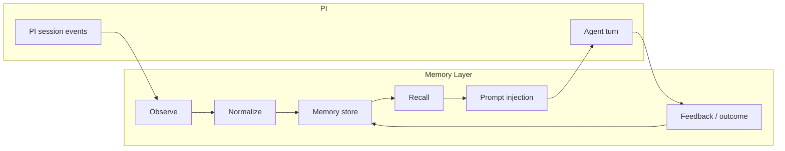

# PI Memory Upgrade Design

> Date: 2026-06-20  
> Scope: reuse PI runtime memory substrate, add experience memory layer, define system + business evaluation

## 1. Goal

PI already has a strong runtime substrate for session persistence, compaction, branch summarization, and extension hooks.  
This design adds the missing layer: **runtime experience memory**.

The goal is not to replace PI's session system. The goal is to turn raw session traces into reusable memory that can:

- recall relevant past decisions
- remember tool outcomes and failure patterns
- persist user and project preferences
- inject compact context before a turn
- improve keyword-analysis decisions over time

The upgrade must improve both:

- **system metrics**: retrieval quality, latency, token cost, freshness, safety
- **business metrics**: keyword analysis route quality, action quality, and repeated-run stability under KOIF

## 2. Current State

PI already provides the following memory substrate:

- session JSONL persistence
- compaction summaries
- branch summaries
- extension persistent entries via `appendEntry()`
- turn lifecycle hooks
- tool call / result hooks
- `before_agent_start` prompt injection

Relevant source areas:

- `pi/packages/coding-agent/src/core/session-manager.ts`
- `pi/packages/coding-agent/src/core/agent-session.ts`
- `pi/packages/coding-agent/src/core/extensions/types.ts`
- `pi/packages/coding-agent/docs/extensions.md`
- `pi/packages/coding-agent/docs/session-format.md`
- `pi/packages/coding-agent/docs/compaction.md`

What is missing today:

- no cross-session recall
- no durable semantic/procedural memory
- no memory decay / conflict handling
- no retrieval ranking
- no feedback loop from outcomes back into memory
- no business-level benchmark tied to KOIF

## 3. Design Principles

1. Reuse PI's session tree and hook model.
2. Keep session history as evidence, not as the memory product itself.
3. Separate source facts from derived memory.
4. Inject memory only when it is relevant and compact.
5. Every memory item must have provenance.
6. Stale memory must lose rank or be suppressed.
7. Business evaluation must reflect KOIF, not just generic IR metrics.

## 4. Options

### Option A: session-only augmentation

Keep everything inside session JSONL and compaction summaries.

Pros: simplest.
Cons: no true recall, poor reuse across sessions, weak ranking.

### Option B: hybrid memory layer over PI substrate

Use PI session history as evidence and add a separate memory store for indexed recall.

Pros: best balance of reuse, control, and quality.
Cons: needs a small storage/indexing layer.

### Option C: external memory service

Move memory into a separate service with its own API and index.

Pros: scalable.
Cons: higher ops cost, weaker local-first fit, more moving parts.

**Recommendation: Option B.**

## 5. Recommended Architecture



### 5.1 Observe

Capture memory-worthy signals from PI hooks:

- `session_start`
- `before_agent_start`
- `tool_call`
- `tool_result`
- `agent_end`
- `session_before_compact`
- `session_compact`
- `session_tree`

### 5.2 Normalize

Convert raw events into memory records:

- episodic: what happened in a turn/session
- semantic: stable facts and conclusions
- procedural: useful workflows or tool sequences
- preference: user/project preferences
- failure: repeated tool or data failure patterns
- domain: KOIF/keyword-analysis findings

### 5.3 Store

Recommended local backend:

- `SQLite` for metadata, provenance, filters, and feedback state
- `FTS` or BM25-style text index for lexical recall
- optional embeddings later for semantic recall
- JSONL export for auditability

### 5.4 Recall

Recall should rank by:

- lexical relevance
- semantic similarity
- recency
- confidence
- importance
- freshness
- conflict suppression

### 5.5 Inject

`before_agent_start` should inject only a small, ranked memory bundle:

- active preferences
- relevant prior decisions
- relevant failure warnings
- domain-specific remembered constraints

### 5.6 Feedback

Each answer or tool outcome should update:

- confidence
- last_used_at
- conflict status
- decay
- suppression list

## 6. Memory Types

| Type | What it stores | Example |
| --- | --- | --- |
| episodic | turn/session events | "last time user asked about keyword demand, route was paid_test" |
| semantic | stable facts | "this category's PFS is weak" |
| procedural | repeated workflows | "ask_api_catalog -> select_tools_for_task -> probe_api_sample" |
| preference | user style and defaults | "prefer concise route output" |
| failure | known bad paths | "this tool returns empty response for this category" |
| domain | KOIF-related conclusions | "high KDS + low PFS should go to page repair" |

## 7. Memory Record Schema

```ts
type MemoryType =
  | "episodic"
  | "semantic"
  | "procedural"
  | "preference"
  | "failure"
  | "domain";

type MemoryRecord = {
  memory_id: string;
  type: MemoryType;
  scope: "session" | "project" | "global";
  subject: string;
  text: string;
  tags: string[];
  confidence: number;      // 0..1
  importance: number;      // 0..1
  freshness: number;       // 0..1
  ttl_days?: number;
  status: "active" | "suppressed" | "expired";
  source_session_id?: string;
  source_entry_ids?: string[];
  source_tool_ids?: string[];
  evidence_refs?: Array<{
    kind: "session" | "tool" | "report" | "run";
    id: string;
  }>;
  created_at: string;
  updated_at: string;
  last_used_at?: string;
  conflict_group?: string;
};
```

## 8. PI Integration Points

### `session_start`

- load project/session-specific memory state
- restore active preferences
- warm up recent relevant memories

### `before_agent_start`

- recall memory based on the user prompt and current system prompt
- inject a short memory bundle into the turn

### `tool_call`

- observe tool choice, arguments, and risk signals
- record failures and missing parameters

### `tool_result`

- record tool success/failure, empty response, and result quality
- promote repeated good patterns into procedural memory

### `agent_end`

- summarize the turn
- extract candidate semantic/procedural memories

### `session_before_compact` / `session_compact`

- convert long histories into durable summarized memory
- keep provenance to the underlying branch

### `session_tree`

- preserve branch-level summaries as reusable memory snapshots

## 9. Interfaces

The memory layer should expose these operations:

```ts
observe(event): void
remember(record): Promise<string>
recall(query, opts): Promise<MemoryRecord[]>
forget(memory_id): Promise<void>
feedback(memory_id, verdict): Promise<void>
summarize_session(session_id): Promise<MemoryRecord[]>
```

PI-facing tools can be added later as thin wrappers:

- `memory_search`
- `memory_write`
- `memory_forget`
- `memory_feedback`

## 10. Evaluation Framework

Evaluation must prove the upgrade actually helps.

### 10.1 System Metrics

| Metric | What it measures | Target direction |
| --- | --- | --- |
| `memory_recall@k` | whether relevant memories are retrieved | up |
| `memory_precision@k` | whether retrieved memories are useful | up |
| `MRR` / `nDCG` | ranking quality | up |
| `recall_latency_ms` | retrieval speed | down |
| `injected_token_cost` | prompt budget consumed by memory | down |
| `stale_injection_rate` | outdated memory used in a turn | down |
| `duplication_rate` | repeated memory copies | down |
| `feedback_convergence_time` | how fast wrong memory is corrected | down |
| `privacy_block_rate` | secrets prevented from persistence | up, with leak rate = 0 |

Minimum system gate: memory must improve retrieval quality without causing noticeable prompt bloat or stale-context regressions.

### 10.2 Business Metrics for KOIF

Use the keyword framework as the business benchmark.

| Metric | What it measures | Expected improvement |
| --- | --- | --- |
| `route_accuracy` | correct route among old product / new product / content / paid | up |
| `route_specificity` | whether output lands on the right KOIF route | up |
| `high_kds_low_pfs_repair_precision` | whether weak承接 cases go to page repair, not paid noise | up |
| `high_tms_low_kds_false_new_product_rate` | whether trend-only noise is rejected from new-product planning | down |
| `paid_route_precision` | whether PVS-driven cases get correct paid actions | up |
| `content_route_precision` | whether CES-driven cases produce useful content angles | up |
| `dimension_coverage_lift` | whether repeated runs fill more missing keyword dimensions | up |
| `data_gap_close_time` | how fast missing data gaps get resolved in follow-up runs | down |
| `repeat_run_stability` | whether same category analyzed twice gives consistent top routes and top keywords | up |
| `action_adoption_rate` | whether operators accept the memory-backed recommendation | up |

### 10.3 KOIF-specific acceptance

The memory layer should improve these KOIF behaviors:

- high KDS + low PFS must reliably route to page/承接 repair
- high KDS + high TMS + high BDS + high NOS must be more precise for new-product opportunities
- high CES cases must map to content topics and visual directions, not paid-only actions
- high PVS cases must output clearer paid actions, including add budget / lower bid / negative keywords
- repeated category analyses should produce more stable KDS top lists and route decisions

### 10.4 Suggested benchmark set

Use two offline benchmark sets:

1. **System memory set**: historical PI sessions with labeled relevant memories.
2. **KOIF keyword set**: category runs across old product, new product, content, and paid cases.

Each benchmark item should record:

- input prompt or category
- gold memory targets
- gold route
- gold action type
- expected gap/coverage outcome

## 11. Upgrade Phases

### Phase 1: capture and store

- capture PI events
- create memory records
- persist provenance

### Phase 2: recall and inject

- add ranking
- add prompt injection
- add memory-aware tool hints

### Phase 3: feedback and decay

- confidence decay
- conflict suppression
- outcome-based promotion

### Phase 4: KOIF benchmark loop

- evaluate keyword route quality
- evaluate route stability across repeated runs
- evaluate action adoption and gap closure

## 12. Success Criteria

The upgrade is successful only if all are true:

1. PI keeps its current session system intact.
2. Memory can be recalled across sessions with provenance.
3. Memory injection stays small and relevant.
4. Stale or conflicting memory does not dominate prompts.
5. System metrics improve against a baseline.
6. KOIF business metrics improve on repeated keyword-analysis runs.

## 13. Open Decision

Recommended first implementation choice:

- local `SQLite` + text index for memory metadata and retrieval
- reuse PI session JSONL as source evidence
- add optional embeddings only after the non-semantic loop is stable

